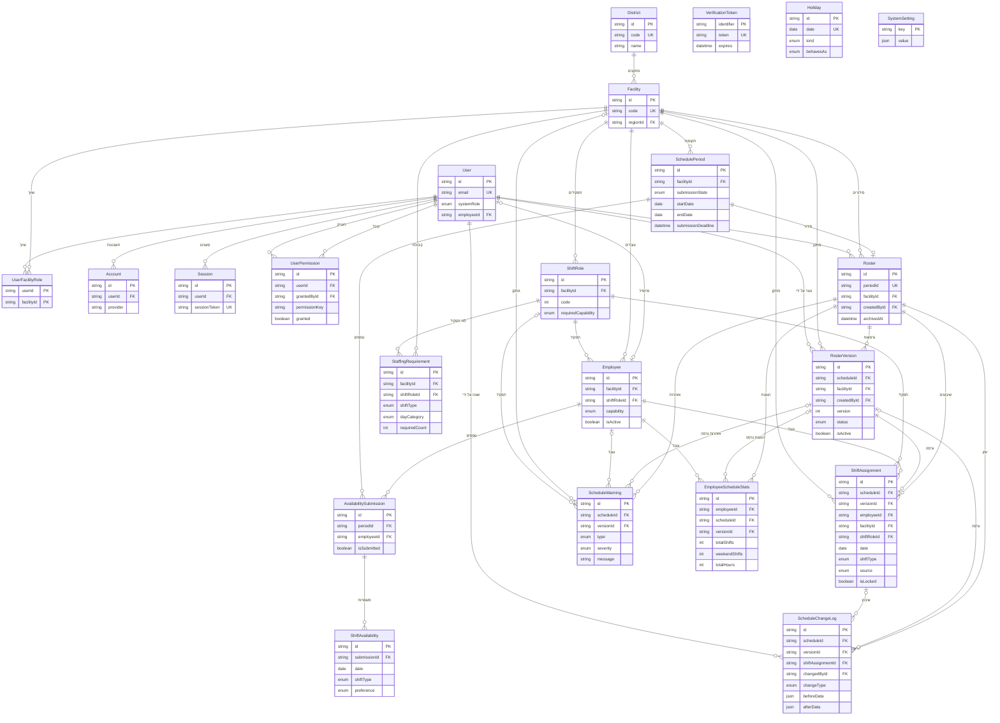

# מודלי Prisma

```mermaid
erDiagram
    District ||--o{ Facility : "מתקנים"
    Facility ||--o{ UserFacilityRole : "שיוך"
    User ||--o{ UserFacilityRole : "שיוך"
    User ||--o{ Account : "חשבונות"
    User ||--o{ Session : "סשנים"
    User ||--o{ UserPermission : "קיבל"
    User ||--o{ UserPermission : "העניק"
    User |o--o| Employee : "פרופיל"
    Facility ||--o{ Employee : "עובדים"
    Facility ||--o{ ShiftRole : "תפקידים"
    ShiftRole ||--o{ Employee : "תפקיד"
    Facility ||--o{ StaffingRequirement : "קיבולת"
    ShiftRole ||--o{ StaffingRequirement : "לפי תפקיד"

    Facility ||--o{ SchedulePeriod : "תקופות"
    Employee ||--o{ AvailabilitySubmission : "טפסים"
    SchedulePeriod ||--o{ AvailabilitySubmission : "טפסים"
    AvailabilitySubmission ||--o{ ShiftAvailability : "משמרות"
    SchedulePeriod ||--o| Roster : "סידור"

    Facility ||--o{ Roster : "סידורים"
    User ||--o{ Roster : "נוצר על ידי"
    Roster ||--o{ RosterVersion : "גרסאות"
    Facility ||--o{ RosterVersion : "מתקן"
    User ||--o{ RosterVersion : "נוצר על ידי"
    Roster ||--o{ ShiftAssignment : "שיבוצים"
    RosterVersion ||--o{ ShiftAssignment : "גרסה"
    Employee ||--o{ ShiftAssignment : "עובד"
    ShiftRole ||--o{ ShiftAssignment : "תפקיד"
    Facility ||--o{ ShiftAssignment : "מתקן"
    Roster ||--o{ ScheduleWarning : "אזהרות"
    RosterVersion |o--o{ ScheduleWarning : "אזהרות גרסה"
    Employee |o--o{ ScheduleWarning : "עובד"
    Facility |o--o{ ScheduleWarning : "מתקן"
    ShiftRole |o--o{ ScheduleWarning : "תפקיד"
    Roster ||--o{ EmployeeScheduleStats : "הוגנות"
    RosterVersion |o--o{ EmployeeScheduleStats : "הוגנות גרסה"
    Employee ||--o{ EmployeeScheduleStats : "עובד"
    Roster ||--o{ ScheduleChangeLog : "יומן"
    RosterVersion |o--o{ ScheduleChangeLog : "גרסה"
    ShiftAssignment |o--o{ ScheduleChangeLog : "שיבוץ"
    User ||--o{ ScheduleChangeLog : "שונה על ידי"

    District {
        string id PK
        string code UK
        string name
    }
    Facility {
        string id PK
        string code UK
        string regionId FK
    }
    User {
        string id PK
        string email UK
        enum systemRole
        string employeeId FK
    }
    Account {
        string id PK
        string userId FK
        string provider
    }
    Session {
        string id PK
        string userId FK
        string sessionToken UK
    }
    VerificationToken {
        string identifier PK
        string token UK
        datetime expires
    }
    UserFacilityRole {
        string userId PK
        string facilityId PK
    }
    UserPermission {
        string id PK
        string userId FK
        string grantedById FK
        string permissionKey
        boolean granted
    }
    Employee {
        string id PK
        string facilityId FK
        string shiftRoleId FK
        enum capability
        boolean isActive
    }
    ShiftRole {
        string id PK
        string facilityId FK
        int code
        enum requiredCapability
    }
    StaffingRequirement {
        string id PK
        string facilityId FK
        string shiftRoleId FK
        enum shiftType
        enum dayCategory
        int requiredCount
    }
    Holiday {
        string id PK
        date date UK
        enum kind
        enum behavesAs
    }
    SchedulePeriod {
        string id PK
        string facilityId FK
        enum submissionState
        date startDate
        date endDate
        datetime submissionDeadline
    }
    AvailabilitySubmission {
        string id PK
        string periodId FK
        string employeeId FK
        boolean isSubmitted
    }
    ShiftAvailability {
        string id PK
        string submissionId FK
        date date
        enum shiftType
        enum preference
    }
    Roster {
        string id PK
        string periodId UK
        string facilityId FK
        string createdById FK
        datetime archivedAt
    }
    RosterVersion {
        string id PK
        string scheduleId FK
        string facilityId FK
        string createdById FK
        int version
        enum status
        boolean isActive
    }
    ShiftAssignment {
        string id PK
        string scheduleId FK
        string versionId FK
        string employeeId FK
        string facilityId FK
        string shiftRoleId FK
        date date
        enum shiftType
        enum source
        boolean isLocked
    }
    ScheduleWarning {
        string id PK
        string scheduleId FK
        string versionId FK
        enum type
        enum severity
        string message
    }
    EmployeeScheduleStats {
        string id PK
        string employeeId FK
        string scheduleId FK
        string versionId FK
        int totalShifts
        int weekendShifts
        int totalHours
    }
    ScheduleChangeLog {
        string id PK
        string scheduleId FK
        string versionId FK
        string shiftAssignmentId FK
        string changedById FK
        enum changeType
        json beforeData
        json afterData
    }
    SystemSetting {
        string key PK
        json value
    }
```
